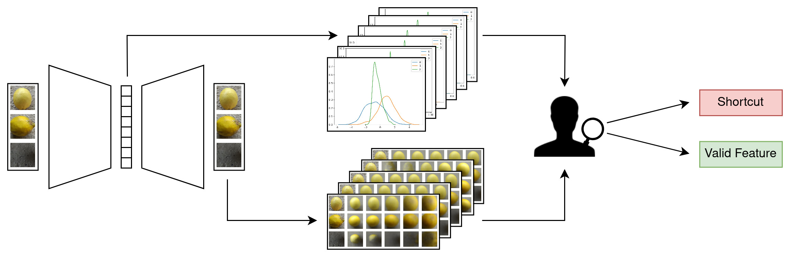

# Shortcut Detection with Variational Autoencoders

This repository contains the code for the paper [Shortcut Detection with Variational Autoencoders](https://arxiv.org/abs/2302.04246) which has been accepted at the ICML Workshop on Spurious Correlations, Invariance and Stability.

For real-world applications of machine learning, it is essential that models make predictions based on well-generalizing features rather than spurious correlations in the data. We present a novel approach to detect such spurious correlations (shortcuts) in image and audio datasets by leveraging variational autoencoders (VAEs). The disentanglement of features in the latent space of VAEs allows us to discover feature-target correlations in datasets and semi-automatically evaluate them for shortcuts. 


We train a Beta-VAE on a dataset containing potential shortcuts. The model discovers independent latent factors in the data and encodes them in its latent dimensions. Evaluating the distribution in the latent space (top) and the weights of a VAE classifier yields a set of candidate dimensions with high predictiveness. The visualization of corresponding latent space traversals (bottom) enables a human judge to identify the meaning of these candidate dimensions and evaluate them for shortcuts/valid features.


## Setup
1. Create a virtual environment using either Python's `venv` or `conda` and activate the environment: 
```
python -m venv .venv
source .venv/bin/activate
```

```
conda create -n shortcut-env python=3.8
conda activate shortcut-env
```

2. Install the dependencies: `pip install -r requirements.txt`


## Datasets
In order to ensure a smooth run of the experiment training and evaluation scripts, you need to make sure that the necessary dataset files are available on your machine. You may need to manually download the files for some of the datasets. The root directory where all datasets are placed should be specified in the config file (`config.yaml`) under the field `data.base_path`.  

The following steps are needed to create each of the datasets used in the experiments in the paper.

1. Colored MNIST
    - Since we are extending the torchvision `MNIST`class to define our dataset, you don't need to manually download the files for this dataset. 
    They will be automatically downloaded to the path specified in the config file. No additional step is required.
    - Provide the command line argument `--dataset_name cmnist_5` when running a script.

2. Lemon Quality
    - Download the dataset from [Kaggle](https://www.kaggle.com/datasets/yusufemir/lemon-quality-dataset).
    - Unzip the downloaded file and place the extracted folder in the dataset root directory.
    - Provide the command line argument `--dataset_name lemon_quality` when running a script.

3. CelebA
    - Since we are extending the torchvision `CelebA` class to define our dataset, you don't need to manually download the files for this dataset. 
    They will be automatically downloaded to the path specified in the config file. No additional step is required.
    - In case the daily google drive quota for automatic downloads is exceeded, you can manually download the dataset [here](https://mmlab.ie.cuhk.edu.hk/projects/CelebA.html). Create a folder named `celeba` in the dataset root directory. Download the in-the-wild images (`img_align_celeba.zip`) and place the unzipped folder (`img_aling_celeba`) in the `celeba` directory. Save the corresponding annotations (all txt-files in the google drive folders `Anno` and `Eval`) also in the `celeba` directory.
    - Provide the command line argument `--dataset_name celeba` when running a script.

4. Waterbirds
    - Download the dataset and extract the content of the tarball in the dataset root directory.
    ```
    wget https://nlp.stanford.edu/data/dro/waterbird_complete95_forest2water2.tar.gz
    tar -zxvf waterbird_complete95_forest2water2.tar.gz
    ```
    - Provide the command line argument `--dataset_name waterbirds` when running a script.

5. Covid
    - Following [DeGrave et al.](https://www.nature.com/articles/s42256-021-00338-7), we combine COVID-19-positive radiographs from the [GitHub-COVID repository](https://github.com/ieee8023/covid-chestxray-dataset) and COVID-19-negative radiographs from the [ChestX-ray14 repository](https://nihcc.app.box.com/v/ChestXray-NIHCC).
    - The setup of both datasets is detailed in the corresponding [repository](https://github.com/suinleelab/cxr_covid). Create a folder named `covid` in the dataset root directory and place the subfolders `ChestX-ray14` and `GitHub-COVID` there.
    - Provide the command line argument `--dataset_name covid` when running a script.

6. ASVspoof
    - We chose a subset of the ASVspoof training data (benign audio and attack A01) for our experiments.
    - Download and unzip the ASVSpoof2019 dataset in the dataset root directory
    ```
    wget https://datashare.ed.ac.uk/bitstream/handle/10283/3336/LA.zip
    unzip LA.zip
    ```
    - Merge the protocol files into a single csv-file
    ```
    cat LA/ASVspoof2019_LA_cm_protocols/*.txt > LA/labels_asv.txt
    ```
    - Generate mel-frequency spectrograms for the ASVspoof training data and save them in a subdirectory of `ASVspoof2019_LA_train` named `mel`.
    ```
    python utils/generate_spectrogram.py --src_dir LA/ASVspoof2019_LA_train/flac --dest_dir LA/ASVspoof2019_LA_train/mel
    ```
    - Provide the command line argument `--dataset_name asv_spoof` when running a script.

## Training the VAE
1. Run `train_vae.py` to train a VAE. The script requires some of the parameters to be passed as command line arguments, while the remaining are parsed from the config file `config.yaml`.

2. For example, the following command trains the VAE on the lemon quality dataset with learning rate 0.001, KL divergence weight 3 and batch size 32 on the GPU device 0. The `type` parameter specifies the VAE model to be used (check `model.py`). We run all of our final experiments with the `ResnetVAE` model which utilizes a ResNet feature encoder.
```
python scripts/train_vae.py --dataset_name lemon_quality --config_file config.yaml --output_dir output --latent_dim 10 --lr 0.001 --kld_weight 3 --batch_size 32 --type ResnetVAE --device 0
```

3. The output of the experiment is saved in the `output` directory. It contains the best model's checkpoint file, tensorboad logging file, experiment config file, and the reconstructed and sampled image files.

4. You can also run multiple experiments by passing multiple values for the hyperparameters. For example, the following command will trigger 24 experiments in sequence with the combination of 2 values of latent dimensionality, 4 values of learning rate and 3 values of KLD weight.
```
python scripts/train_vae.py --dataset_name lemon_quality --config_file config.yaml --latent_dim 10 32 --lr 0.001 0.005 0.01 0.1 --kld_weight 2 3 5 --batch_size 32 --type ResnetVAE --device 0
```

5. The output and log files of each experiments will be saved in the respective folders in the `output` directory.

6. Note that if you repeat the same experiment with an identical configuration as before, it will be saved as a successive version of the earlier experiments in the output directory.


## Statistical Analysis & Latent Space Traversal
1. The latent space of a trained VAE can be evaluated with the script `evaluate_latent_space.py`. It identifies the latent dimensions with the largest maximum pairwise Wasserstein distance (MPWD) and visualizes latent space traversal for each dimension.
The script requires the same parameters to be passed as those required for the train script i.e. a few of the experiment hyperparameters and the path to the config file.
```
python scripts/evaluate_latent_space.py --dataset_name lemon_quality --config_file config.yaml --output_dir output --latent_dim 10 --lr 0.001 --kld_weight 3 --batch_size 32 --type ResnetVAE --device 0
```

2. By default, this will run evaluation on the most recent version `n` of the experiments denoted by `version_n` in the output directory. If you want to run any other version, say `version_0`, you can specify the same using an optional argument `-v` or `--version`. 
```
python scripts/evaluate_latent_space.py --dataset_name lemon_quality --config_file config.yaml --output_dir output --latent_dim 10 --lr 0.001 --kld_weight 3 --batch_size 32 --type ResnetVAE --device 0 -v 0
```

3. The result of the latent space analysis is stored in a folder named `latent_analyis` in the same directory as the output folder. The `stdout` output during the experiment is stored in a text file `output_latent_analysis.txt` in the same directory.


## Classification with VAE Encoder
To evaluate the predictiveness of the latent variables, train a classifier with a frozen pre-trained VAE encoder as backbone and a linear classification layer. The pre-trained VAE will be chosen based on the provided hyperparameters.

Please run the following script:
```
python scripts/evaluate_predictiveness.py --dataset_name lemon_quality --config_file config.yaml --output_dir output --latent_dim 10 --lr 0.001 --kld_weight 3 --batch_size 32 --type ResnetVAE --device 0
```


## Comparison with Heatmaps
In this section, we detail the generation of heatmaps based on the paper [Salient ImageNet: How to discover spurious features in deep learning?](https://arxiv.org/abs/2110.04301).

1. First train a [CNN classifier](models/classifiers.py) on one of the datasets. The best checkpoint will be saved in a folder named `CNNClassifier` in the dataset subdirectory of the output directory.
```
python scripts/train_cnn_classifier.py --dataset_name lemon_quality --config_file config.yaml --output_dir output --device 0
```

2. Run `evaluate_heatmaps.py` to generate heatmaps. Specify the path to the checkpoint of the best CNN classifier and the class for which you want to plot the heatmaps.
```
python scripts/evaluate_heatmaps.py --dataset_name lemon_quality --config_file config.yaml --output_dir output --device 0 --checkpoint [CHECKPOINT-PATH] --class_index 0
```

## Acknowledgements
We appreciate the following repositories and websites for their valuable code:
* https://github.com/AntixK/PyTorch-VAE
* https://github.com/suinleelab/cxr_covid
* https://github.com/singlasahil14/salient_imagenet
* https://www.kaggle.com/code/maunish/training-vae-on-imagenet-pytorch


## Citation
If you find this repository helpful, please kindly cite our paper:
```
@article{muller2023shortcut,
  title={Shortcut Detection with Variational Autoencoders},
  author={M{\"u}ller, Nicolas M and Roschmann, Simon and Khan, Shahbaz and Sperl, Philip and B{\"o}ttinger, Konstantin},
  booktitle={ICML 2023 Workshop on Spurious Correlations, Invariance and Stability},
  year={2023}
}
```

## Contact
If you have any questions or concerns, please feel free to contact us: simon.roschmann@tum.de, shahbaz.khan@tum.de